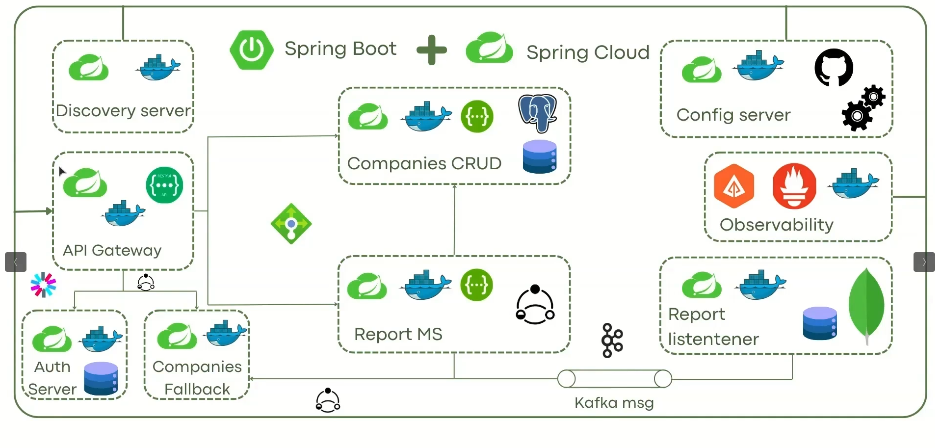

# Spring Boot Micro Servicios

Es una  práctica para desarrollar  mis habilidades en el desarrollo de microservicios utilizando Spring Boot y Spring Cloud. Es parte de un curso [Microservicios con Spring Cloud y Spring Boot 2024](https://www.udemy.com/share/10ajKK3@0rRZYQH13p4KkkFdk0kKEgjnG9CxEBLwFJzOxdYzAT1OMgZ36dY3sdr0IE9XJoT8sQ==/)

## Descripción

En este proyecto, trabajo en diversas áreas del desarrollo de microservicios, incluyendo:

- **Desarrollo de Microservicios con Spring Cloud y Spring Boot:** Utilizando las capacidades de Spring Cloud y Spring Boot para crear servicios independientes y escalables.
- **Desarrollo de API REST con Spring Boot:** Creación de APIs RESTful para la comunicación entre servicios y con aplicaciones externas.
- **Creación de Imágenes y Contenedores con Docker:** Uso de Docker para crear imágenes y contenedores que faciliten el despliegue y la gestión de microservicios.
- **Seguridad en Microservicios con OAUTH 2 y JWT:** Implementación de seguridad robusta para la autenticación y autorización de usuarios y servicios utilizando OAUTH 2 y JWT.
- **Trazabilidad Distribuida con Zipkin y OpenTelemetry:** Implementación de soluciones para la trazabilidad y monitoreo de servicios distribuidos, facilitando la identificación y resolución de problemas.

## Tecnologías Utilizadas

- **Spring Boot**
- **Spring Cloud**
- **Docker**
- **OAUTH 2**
- **JWT**
- **Zipkin**
- **OpenTelemetry**

## Arquitectura
- screenshot de imagen de curso 

## Enlaces

- [Código disponible en GitHub](https://github.com/marco-jaram/MicroService-SpringBoot)

## Contacto

Para más información, puedes contactarme a través de mi [correo electrónico](mailto:marco.jaramillocas@gmail.com) o seguirme en [LinkedIn](https://www.linkedin.com/in/marcojaram/).

